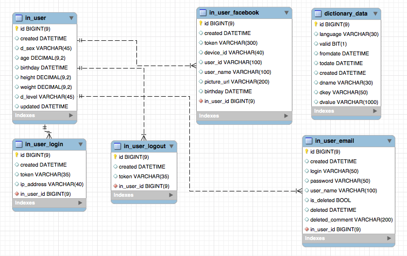
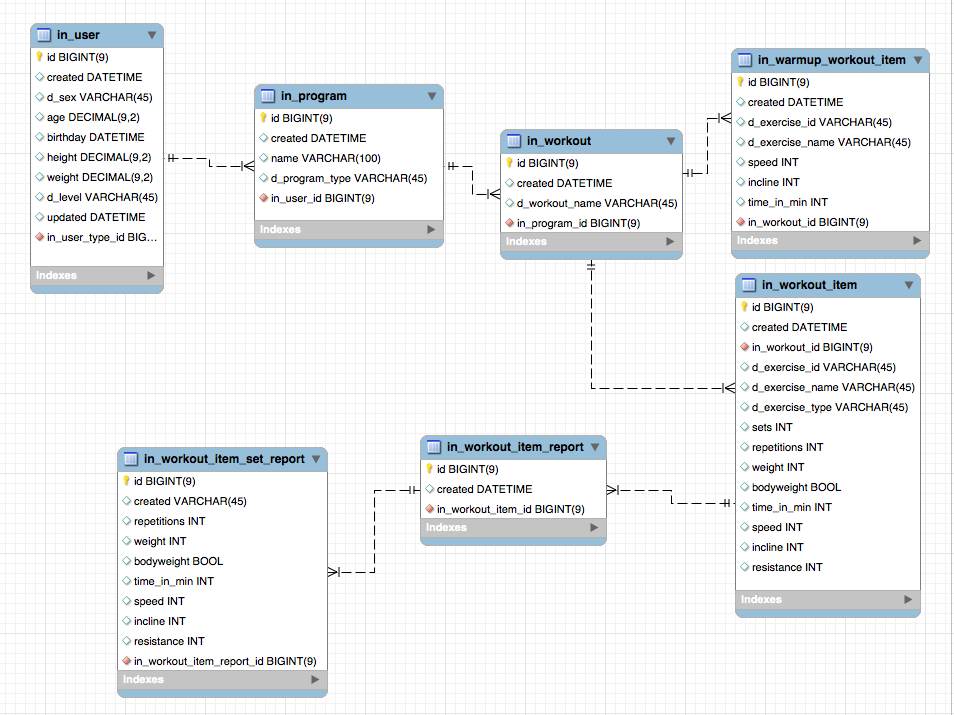
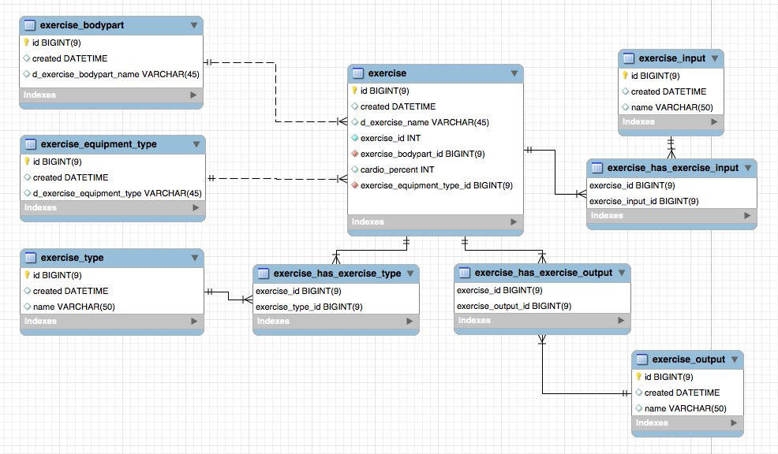
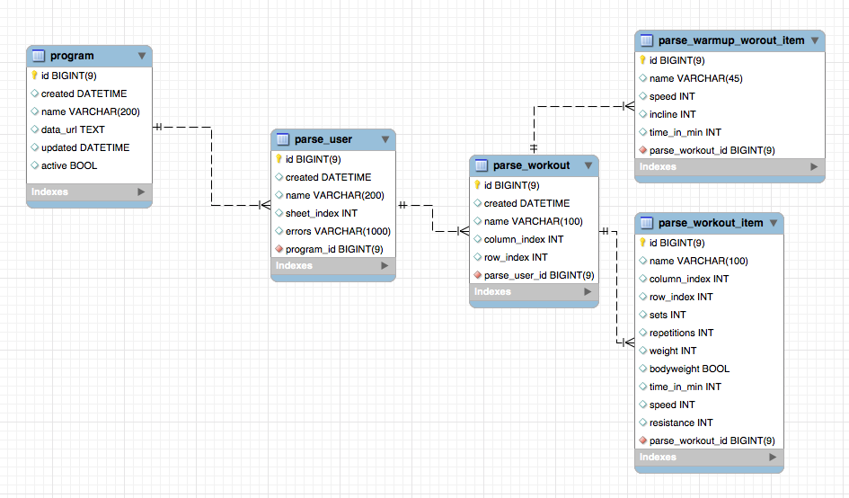
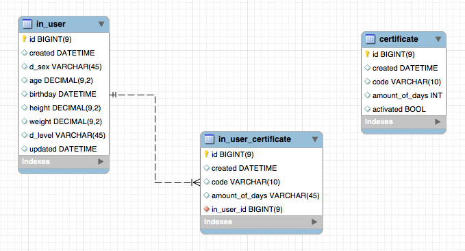
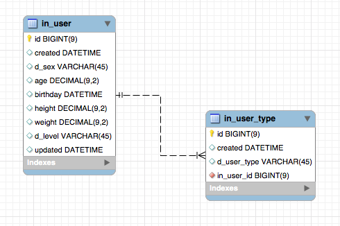
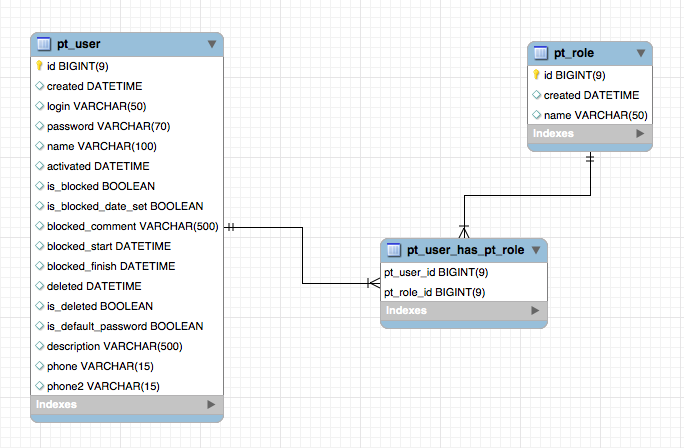

User data store db schema:

User's program data store db schema:

Exercise data store db schema:

User extra data store db schema:

Admin program data store db schema:

Admin certificate data store db schema:

User type data store db schema:

PT user and pt role store db schema:

